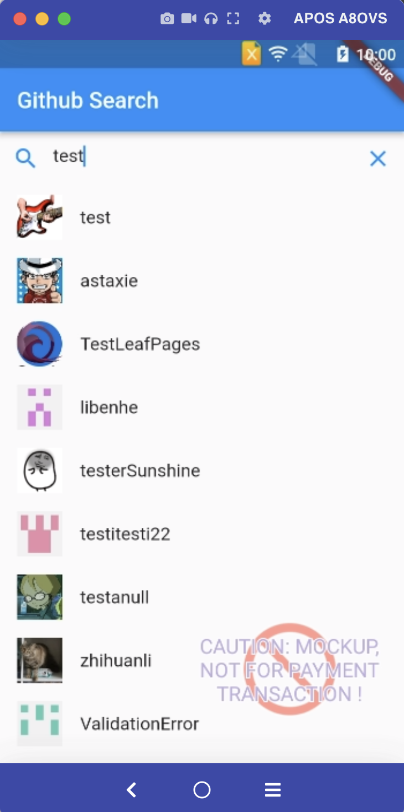

GitHubUsers
=================
A simple Flutter project for learning purpose.

Architecture & Libraries Used
--------------

- Architecture: Clean Architecture
- Libraries:
    * get_it: for Dependency Injection.
    * flutter_bloc: State management.
    * equatable: Value equality.
    * dartz: Functional programming
    * url_launcher: A Flutter plugin for launching a URL

Screenshots
-----------

