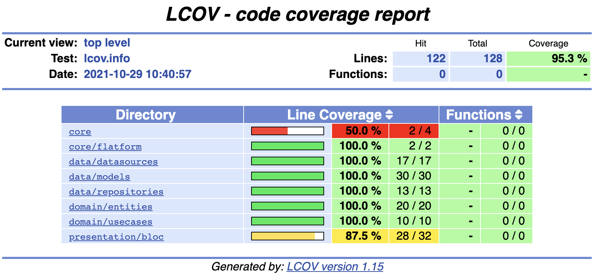

Coverage Info
=================
A simple Flutter project for learning purpose.

Installation
--------------
To convert Icov.info to HTML pages to view test results

### Installing in Ubuntu

`
sudo apt-get update -qq -y
sudo apt-get install lcov -y
`
###  Installing in Mac

`
brew install lcov
`

### Run tests, generate coverage files and convert to HTML

`
flutter test --coverage
genhtml coverage/lcov.info -o coverage/html
`

Coverage Image
-----------

